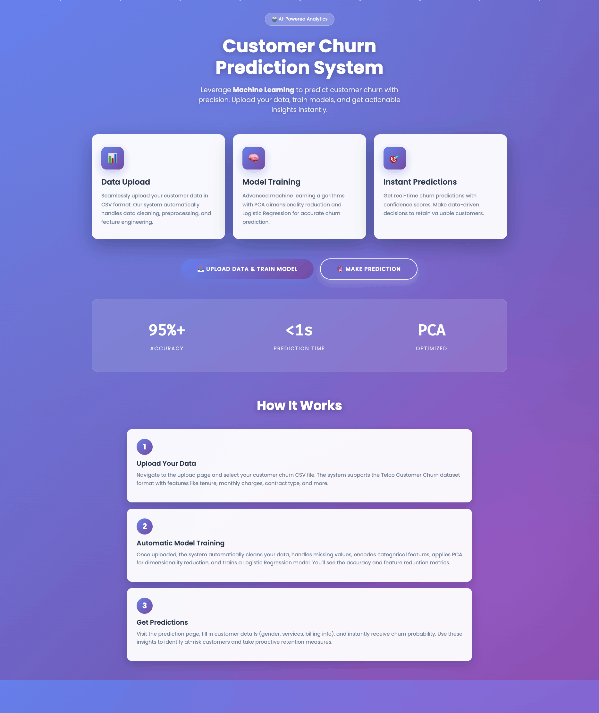
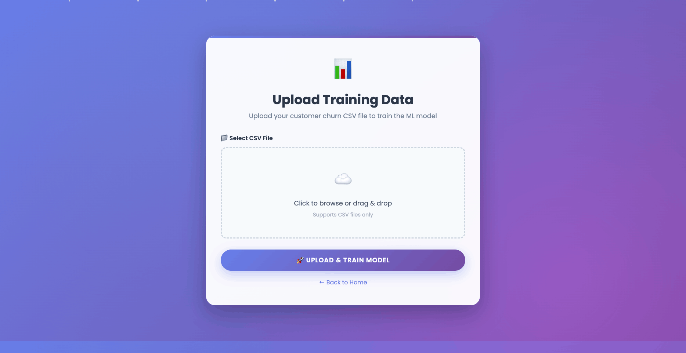
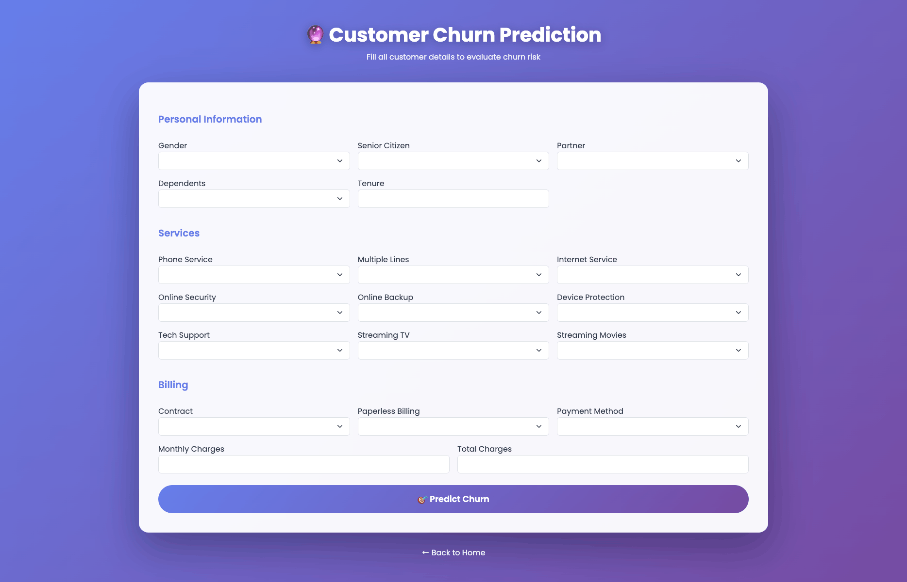

# 📊 Customer Churn Prediction System (ML + Flask)

> **End-to-end machine learning web application** for predicting customer churn using real customer behavior data.

🔗 **Tech:** Python · Flask · Scikit-Learn · Pandas · Bootstrap
🎯 **Focus:** ML → Production → UX

### 👉 **This is not just a model — it’s a system.**

---

## 🚀 Project Overview

This project demonstrates how **machine learning models can be deployed as a real web application** to support business decision-making.

Users can:

* Upload customer data
* Train a churn prediction model
* Make real-time predictions
* Interpret churn risk with probabilities and recommendations

---

## 🖼️ Application Screenshots

### 🏠 Home Page



### 📤 Upload & Train Model



### 🔮 Churn Prediction Result



---

## 🧠 Machine Learning Workflow

1. Data Cleaning
2. Missing Value Handling
3. Categorical Encoding
4. Feature Scaling
5. PCA Dimensionality Reduction
6. Logistic Regression Training
7. Model Persistence
8. Real-time Prediction

---

## 📊 Model Interpretation

| Churn Probability | Risk Level | Action              |
| ----------------- | ---------- | ------------------- |
| 0–30%             | 🟢 Low     | No action needed    |
| 30–60%            | 🟡 Medium  | Monitor & engage    |
| 60–100%           | 🔴 High    | Immediate retention |

**Example Output**

```
Not Churn: 74.3%
Churn: 25.7%
Risk Level: Low
```

---

## ⚙️ How to Run Locally

```bash
git clone https://github.com/Hasan082/Machine-Learning-Full-Directory.git
cd ProjectCustomerChunk
python -m venv venv
source venv/bin/activate
pip install -r requirements.txt
python app.py
```

App runs at:

```
http://127.0.0.1:5000
```

---

## ✨ Features

* ✅ End-to-end ML pipeline
* ✅ PCA dimensionality reduction
* ✅ Probability-based predictions
* ✅ Risk classification (Low / Medium / High)
* ✅ Clean UI with modern design
* ✅ Model persistence with Joblib
* ✅ Error handling and validation

---

## 🧩 Dataset

Designed for **Telco Customer Churn Dataset**
🔗 [https://www.kaggle.com/datasets/blastchar/telco-customer-churn](https://www.kaggle.com/datasets/blastchar/telco-customer-churn)

Applicable to:

* Subscription-based services
* SaaS churn analysis
* Telecom analytics

---

## 👨‍💻 Why This Project Matters

* Practical ML deployment
* Clean backend architecture
* UX-aware ML predictions
* Real-world problem solving

---

## 📌 Author

**MD HASANUZZAMAN (HASAN)**
Backend Engineer(Django/Flask/FastAPI ) · Aspiring Machine Learning Engineer · Data Scientist
